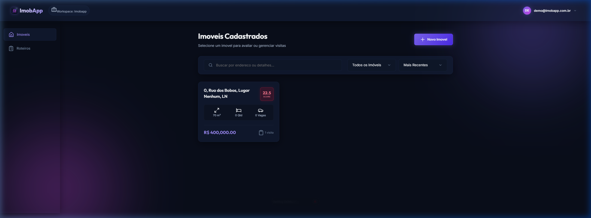
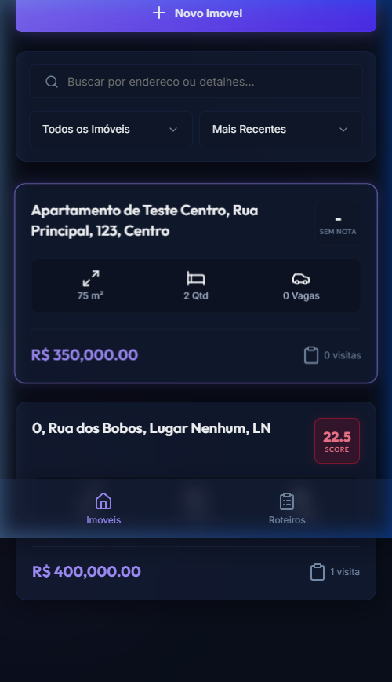
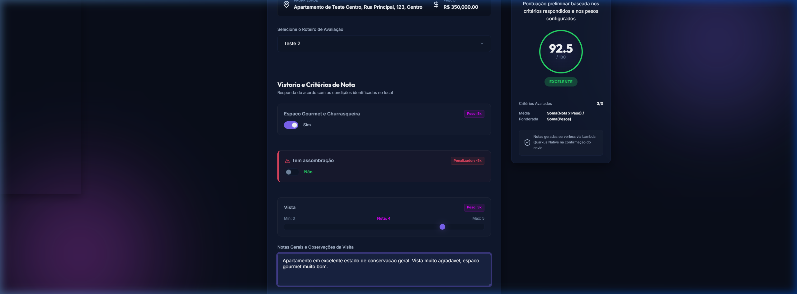
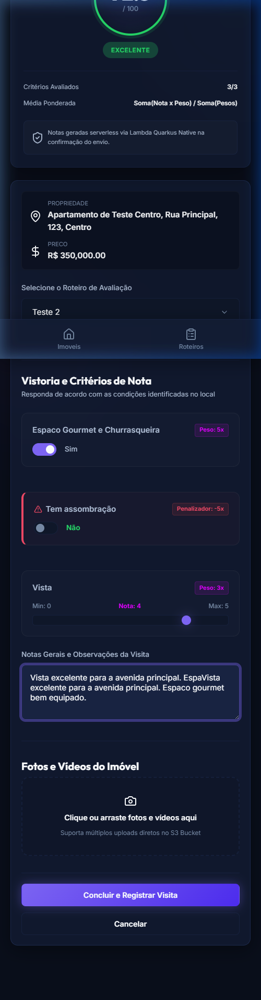
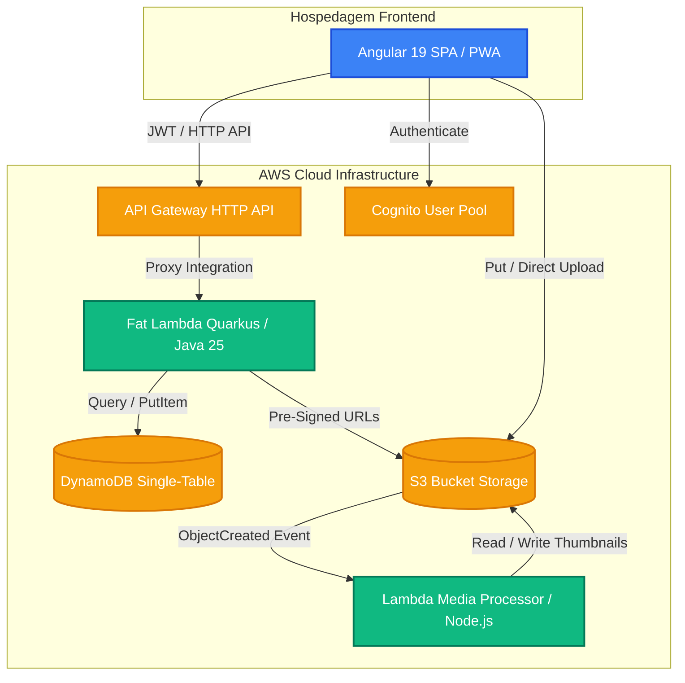
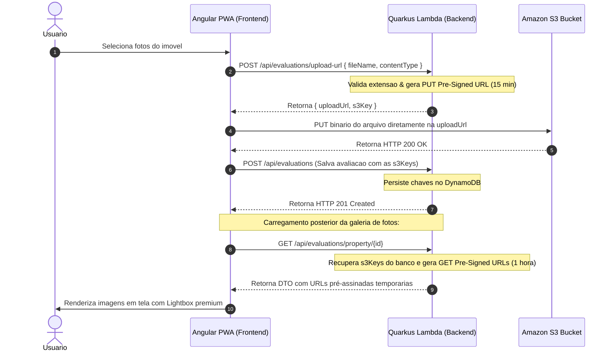

# ImobApp - Plataforma de Avaliação de Imóveis

Este é um monorepo que contém o frontend e o backend da ImobApp, um sistema serverless de alta performance focado na criação e execução de protocolos de avaliação (Templates) de imóveis visitados.

O sistema suporta a criação de formulários dinâmicos, cálculo automático de pontuação por pesos, registro de dados do imóvel e upload direto de fotos para o Amazon S3 utilizando URLs pré-assinadas (Pre-Signed URLs).

<details>
  <summary><h2>Screenshots</h2></summary>

<table align="center" style="width: 100%; border-collapse: collapse; border: none;">
  <tr style="border: none;">
    <td align="center" style="width: 70%; border: none; padding: 10px; vertical-align: top;">
      <strong>Painel de Imóveis (Dashboard) - Desktop</strong><br><br>
      
    </td>
    <td align="center" style="width: 30%; border: none; padding: 10px; vertical-align: top;">
      <strong>Painel de Imóveis - Mobile</strong><br><br>
      
    </td>
  </tr>
  <tr style="border: none;">
    <td align="center" style="width: 70%; border: none; padding: 20px 10px 10px 10px; vertical-align: top;">
      <strong>Formulário de Avaliação Dinâmica (Vistoria) - Desktop</strong><br><br>
      
    </td>
    <td align="center" style="width: 30%; border: none; padding: 20px 10px 10px 10px; vertical-align: top;">
      <strong>Vistoria - Mobile</strong><br><br>
      
    </td>
  </tr>
</table>

</details>


## Estrutura do Repositório

O projeto está estruturado no formato de monorepo:

*   **[backend/](backend):** Código-fonte em Java 25 utilizando o framework Quarkus compilado para Imagem Nativa (GraalVM), empacotado para execução em ambiente AWS Lambda (Fat Lambda). Também contém o arquivo de infraestrutura do AWS SAM (`template.yaml`).
*   **[frontend/](frontend):** Aplicação Single Page Application (SPA) desenvolvida em Angular configurada como Progressive Web App (PWA) e hospedada na Vercel.


## Arquitetura do Sistema e Fluxos de Dados

### Arquitetura de Componentes do Monorepo

O sistema utiliza a arquitetura serverless no backend e SPA no frontend, otimizada para baixo custo e tempos de resposta rápidos.



### Fluxo de Upload e Visualização de Fotos via S3 Pre-Signed URLs

Para contornar o limite de payload de 10MB do API Gateway, a transferência binária de mídias é realizada diretamente entre o cliente frontend e o Amazon S3.



<details>
  <summary><h2>Installation</h2></summary>

### Pré-requisitos para Desenvolvimento Local

Para rodar o projeto localmente, certifique-se de possuir instalado:

*   Java Development Kit (JDK) 25
*   Maven 3.9+
*   Node.js (LTS) e npm
*   Docker e Docker Compose
*   AWS CLI e AWS SAM CLI

### Como Executar o Projeto Localmente

#### 1. Inicializar a Infraestrutura Local e o Backend (Quarkus)

O projeto utiliza containers com DynamoDB Local e LocalStack (para o S3 simulado) no desenvolvimento local. O backend Quarkus roda em modo de desenvolvimento.

**Passo a passo manual:**

A) Suba os recursos de infraestrutura utilizando o Docker Compose:
```bash
docker compose up -d localstack dynamodb
```

B) Acesse a pasta do backend e inicie o Quarkus em modo de desenvolvimento (o modo de desenvolvimento local habilita o bypass de autenticação por padrão, `imob.mock.auth=true`):
```bash
cd backend/api
mvn quarkus:dev
```

**Alternativa rápida via Makefile (Recomendado):**

Para subir a infraestrutura Docker e rodar o backend Quarkus em modo de desenvolvimento com um único comando, execute:
```bash
make back
```
O backend estará disponível em `http://localhost:8080`.


#### 3. Executar o Frontend (Angular)

Instale as dependências e inicie o servidor de desenvolvimento do Angular. O frontend está configurado com um proxy local (`proxy.conf.json`) para redirecionar todas as chamadas de `/api/*` para o backend rodando em `http://localhost:8080`:

```bash
cd frontend
npm install
npm start
```
ou utilizando o Makefile:
```bash
make front
```
O frontend estará disponível em `http://localhost:4200`.

</details>

<details>
  <summary><h2>Infrastructure (AWS SAM)</h2></summary>

A infraestrutura serverless na AWS é provisionada via **AWS SAM** a partir do arquivo [backend/template.yaml](backend/template.yaml). Ele declara os seguintes recursos:

*   **ImobAppTable (DynamoDB):** Tabela no padrão Single-Table Design usando chaves genéricas `PK` e `SK` com modo de cobrança sob demanda (`PAY_PER_REQUEST`).
*   **ImobAppBucket (S3):** Bucket para armazenamento de fotos das vistorias, configurado com regras de CORS estritas e bloqueio de acesso público direto (acesso binário via URLs pré-assinadas de PUT e GET).
*   **ImobAppUserPool e UserPoolClient (Cognito):** Provedor de Identidade configurado para login via e-mail e senha.
*   **ImobAppHttpApi (API Gateway):** Gateway de API HTTP integrado via proxy com a Lambda. Por padrão, a validação de assinatura de JWT Cognito está configurada como não-obrigatória no Gateway para permitir o uso de logins simulados em ambientes de staging.
*   **ImobAppFunction (Lambda):** Função executando o Quarkus em Imagem Nativa (GraalVM) sob o runtime customizado `provided.al2023`. Recebe os nomes dos recursos criados dinamicamente via variáveis de ambiente (`IMOB_TABLE_NAME` e `IMOB_BUCKET_NAME`).

Para validar a integridade do arquivo SAM localmente, execute:
```bash
cd backend
sam validate --template-file template.yaml
```

</details>


<details>
  <summary><h2>CI/CD & Deployment</h2></summary>

As pipelines de deploy automatizado estão disponíveis na pasta `.github/workflows`:

### 1. Deploy do Backend e Infraestrutura
Localização: [.github/workflows/deploy-backend.yml](.github/workflows/deploy-backend.yml)

Disparada via `workflow_dispatch` (manual), esta pipeline:
1. Configura o JDK 25 e realiza o cache do Maven.
2. Compila a imagem nativa do Quarkus dentro de um container Docker, gerando o artefato `backend/target/function.zip`.
3. Instala e configura o AWS SAM CLI.
4. Realiza o deploy da infraestrutura e código na AWS usando o comando `sam deploy`.

### 2. Deploy do Frontend
Localização: [.github/workflows/deploy-frontend.yml](.github/workflows/deploy-frontend.yml)

Disparada via `workflow_dispatch` (manual) após o deploy com sucesso do backend, esta pipeline:
1. Configura o Node.js e instala as dependências do frontend.
2. Consulta a stack do CloudFormation correspondente no AWS SAM para obter a URL gerada para a API Gateway.
3. Cria dinamicamente o arquivo de configuração `vercel.json` no diretório do frontend, aplicando a regra de reescrita proxy que direciona as chamadas de `/api/*` da Vercel para a URL da API Gateway da AWS correspondente.
4. Realiza o build e o deploy da aplicação Angular na Vercel através da CLI da Vercel.

### Secrets Necessárias no Repositório do GitHub

Para a execução correta das pipelines, configure os seguintes segredos nas definições de segredos do GitHub (Actions Secrets):

*   `AWS_ACCESS_KEY_ID`: Chave de acesso AWS com permissões para provisionamento e deploy de recursos (SAM).
*   `AWS_SECRET_ACCESS_KEY`: Chave secreta AWS.
*   `AWS_DEFAULT_REGION`: Região padrão da AWS (ex: `us-east-1`).
*   `VERCEL_TOKEN`: Token de autenticação da sua conta Vercel.
*   `VERCEL_ORG_ID`: ID da Organização na Vercel associada ao projeto.
*   `VERCEL_PROJECT_ID`: ID do Projeto na Vercel associada ao frontend.


### Permissões IAM Necessárias para o Usuário AWS

O usuário IAM associado às chaves `AWS_ACCESS_KEY_ID` e `AWS_SECRET_ACCESS_KEY` configuradas nos segredos do repositório necessita de permissões para criar, alterar e gerenciar todos os recursos provisionados pelo AWS SAM.

#### Opção 1: Administrador (Recomendado para Dev/Staging)
Anexe a política gerenciada da AWS **`AdministratorAccess`** ao usuário IAM do pipeline. Esta é a forma mais prática para que o AWS SAM consiga gerenciar o ciclo de vida dos recursos e criar papéis do IAM dinamicamente.

#### Opção 2: Políticas Específicas (Menor Privilégio para Produção)
Se o ambiente exigir restrições estritas de segurança, configure uma política IAM customizada que conceda permissões para as seguintes áreas e ações:
*   **AWS CloudFormation (`cloudformation:*`):** Para criar e atualizar as stacks da aplicação (`imob-app-infra-*`).
*   **AWS IAM:**
    *   `iam:CreateRole`
    *   `iam:DeleteRole`
    *   `iam:GetRole`
    *   `iam:PassRole` (obrigatório para associar a role de execução à Lambda)
    *   `iam:PutRolePolicy`
    *   `iam:DeleteRolePolicy`
    *   `iam:AttachRolePolicy`
    *   `iam:DetachRolePolicy`
*   **AWS Lambda (`lambda:*`):** Para publicar e atualizar a Lambda com Quarkus Native.
*   **Amazon S3 (`s3:*`):** Para o bucket de deploy do SAM e o bucket de fotos do aplicativo.
*   **Amazon DynamoDB (`dynamodb:*`):** Para criar e gerenciar a tabela do sistema.
*   **Amazon Cognito (`cognito-idp:*`):** Para provisionar os pools de usuário e clientes de aplicativo.
*   **Amazon API Gateway (`apigateway:*`):** Para criar o gateway HTTP, rotas e estágios.

> [!IMPORTANT]
> **Ajuste para Tagging do API Gateway v2 (HTTP APIs):** Devido a limitações da política gerenciada padrão `AmazonAPIGatewayAdministrator` no tratamento de ARNs codificados para gerenciamento de tags pelo AWS SAM, é necessário anexar uma política inline ao usuário IAM com as seguintes permissões para evitar erros de `AccessDenied` na criação da stack:
> ```json
> {
>     "Version": "2012-10-17",
>     "Statement": [
>         {
>             "Effect": "Allow",
>             "Action": [
>                 "apigateway:*"
>             ],
>             "Resource": "*"
>         }
>     ]
> }
> ```

</details>

